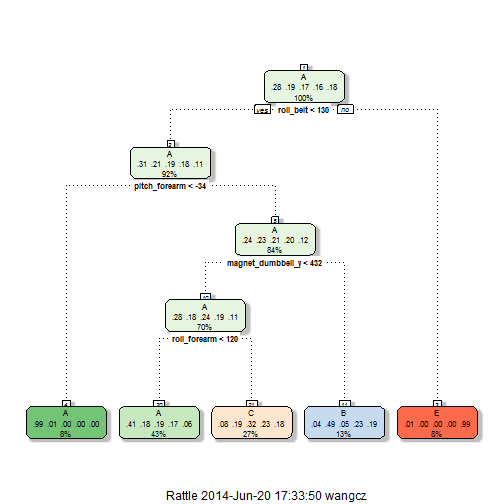

Predict Exercise Classes from Sensor Data
======================================================
This is the project report for the Coursera course Practical Machine Learning.
In this project, we use the Weight Lifting Exercises Dataset from http://groupware.les.inf.puc-rio.br/har#dataset.

The Dataset contains readings from accelerometer on belt, forearm, arm and dumbell of 6 healthy participants performing barbell lifting in 1 correc way and 4 incorrect ways. We build machine learning model to predict the way in which the exercise was done given the accelerometer readings. 

# Data Loading and Processing
The data are downloaded from the course web site https://d396qusza40orc.cloudfront.net/predmachlearn/pml-training.csv and 
https://d396qusza40orc.cloudfront.net/predmachlearn/pml-testing.csv. Documentations are provided at Human Activity Recognition [Weight Lifiting Exercises Dataset](http://groupware.les.inf.puc-rio.br/har#dataset). 

The data is downloaded, and loaded as follows (change your working directory if necessary):


```r
myLoadData <- function(url, dest) {
    if (!file.exists(dest)) {
        download.file(url, dest, "wget")
    }
    read.csv(dest)
}
training <- myLoadData("https://d396qusza40orc.cloudfront.net/predmachlearn/pml-training.csv", 
    "pml-training.csv")
testing <- myLoadData("https://d396qusza40orc.cloudfront.net/predmachlearn/pml-testing.csv", 
    "pml-testing.csv")
```


This dataset includes 

```

Error in eval(expr, envir, enclos) : object 'mytst' not found

```

 variables. Among them, derived variables with prefix "var_", "stddev_", "avg_", "min_", "max_", "amplitude_", "skewness_", "kurtosis_" are mostly NAs in the training and testing datasets. As a result, we ignore these variables. For simplicity, we also ignore the temporal variables and user_name variable, assuming the categories of exercise mistakes is independent of time or subjects. Note that in the referenced paer (see details at the end of this report), those derived variables instead of the raw ones are actually used. Unfortunately, in our course dataset, for some reason, we only have the raw sensor inputs, which might limit our prediction accuracy.

<!--
We still have lots of variables, and would like to reduce them using feature selection


```r
# library(caret) set.seed(2014) inFeature <- apply(is.na(testing), 2, sum) <
# dim(testing)[1] # ignore NA only columns inFeature <- inFeature &
# !grepl('^X$|user_name|window|timestamp', names(testing)) inSelection <-
# createDataPartition(y=training$classe, p=0.1, list=FALSE) mysel <-
# training[inSelection, inFeature] x <- mysel[,-53] y <- mysel[,53] myrfe <-
# rfe(x, y, rfeControl=control)
```

-->


```r
library(caret)
set.seed(2014)
inFeature <- apply(is.na(testing), 2, sum) < dim(testing)[1]  # ignore NA only columns
inFeature <- inFeature & !grepl("^X$|user_name|window|timestamp", names(testing))
inTrain <- createDataPartition(y = training$classe, p = 0.75, list = FALSE)
mytrn <- training[inTrain, inFeature]
myvld <- training[-inTrain, inFeature]
mytst <- testing[, inFeature]
```


# Analysis
As the data is large, I first tried classification tree (rpart) due to its interpertability and fast speed. For simplicity, we did not try to subselect features, but rather to use all remaining variables to predict the classe variable. Note that the the default 10-fold repeated cross validation is used in trainControl for the training phase. 


```r
modrpart <- train(classe ~ ., method = "rpart", data = mytrn, trControl = trainControl(method = "repeatedcv"))
library(rattle)
fancyRpartPlot(modrpart$finalModel)
```

 

```r
cmRpartTrn <- confusionMatrix(predict(modrpart, newdata = mytrn), mytrn$classe)
cmRpartTrn$overall
```

```
##       Accuracy          Kappa  AccuracyLower  AccuracyUpper   AccuracyNull 
##         0.4923         0.3370         0.4841         0.5004         0.2843 
## AccuracyPValue  McnemarPValue 
##         0.0000            NaN
```

As shown in the illustrated classification tree, the classification model fails totally to capture the class D. The in-sample error is high (as Accuracy is low). Usually, we expect a higher out-of-sample error (lower Accuracy) in the validation date than in the training data. In this case, the accurracies are almost the same, though slighter higher, likely due to the poor fitting of the training data in the model from the beginning. More detials of the confusionMatrix is not shown due to the space limit.


```r
cmRpartVld <- confusionMatrix(predict(modrpart, newdata = myvld), myvld$classe)
cmRpartVld$overall
```

```
##       Accuracy          Kappa  AccuracyLower  AccuracyUpper   AccuracyNull 
##      5.051e-01      3.542e-01      4.910e-01      5.192e-01      2.845e-01 
## AccuracyPValue  McnemarPValue 
##     1.667e-231            NaN
```


Hence, I then train a random forest model for the data (note that this takes a long time for the large number of variables and rows).


```r
set.seed(2014)
modrf <- train(classe ~ ., method = "rf", data = mytrn)
```

```
## Loading required package: randomForest
## randomForest 4.6-7
## Type rfNews() to see new features/changes/bug fixes.
```

```r
cmRfVld <- confusionMatrix(predict(modrf, newdata = myvld), myvld$classe)
cmRfTrn <- confusionMatrix(predict(modrf, newdata = mytrn), mytrn$classe)
```


As shown below, the out-of-sample error is much lower (as the Accuracy is above 99%) when predicting the classe variable on the validation dataset using the random forest method. Indeed, each class, including D, is predicted with high sensitivity and specificity.


```r
cmRfVld$overall
```

```
##       Accuracy          Kappa  AccuracyLower  AccuracyUpper   AccuracyNull 
##         0.9914         0.9892         0.9884         0.9938         0.2845 
## AccuracyPValue  McnemarPValue 
##         0.0000            NaN
```

```r
cmRfVld$byClass
```

```
##          Sensitivity Specificity Pos Pred Value Neg Pred Value Prevalence
## Class: A      0.9978      0.9972         0.9929         0.9991     0.2845
## Class: B      0.9874      0.9985         0.9936         0.9970     0.1935
## Class: C      0.9906      0.9956         0.9792         0.9980     0.1743
## Class: D      0.9813      0.9985         0.9925         0.9963     0.1639
## Class: E      0.9956      0.9995         0.9978         0.9990     0.1837
##          Detection Rate Detection Prevalence Balanced Accuracy
## Class: A         0.2838               0.2859            0.9975
## Class: B         0.1911               0.1923            0.9929
## Class: C         0.1727               0.1764            0.9931
## Class: D         0.1609               0.1621            0.9899
## Class: E         0.1829               0.1833            0.9975
```


Note that, using the random forest model, the in-sample error is slightly lower than the out-of-sample error (the in-sample accuracy, shown below, is slight higher than the out-of-sample accuracy):

```r
cmRfTrn$overall
```

```
##       Accuracy          Kappa  AccuracyLower  AccuracyUpper   AccuracyNull 
##         1.0000         1.0000         0.9997         1.0000         0.2843 
## AccuracyPValue  McnemarPValue 
##         0.0000            NaN
```

```r
cmRfTrn$byClass
```

```
##          Sensitivity Specificity Pos Pred Value Neg Pred Value Prevalence
## Class: A           1           1              1              1     0.2843
## Class: B           1           1              1              1     0.1935
## Class: C           1           1              1              1     0.1744
## Class: D           1           1              1              1     0.1639
## Class: E           1           1              1              1     0.1839
##          Detection Rate Detection Prevalence Balanced Accuracy
## Class: A         0.2843               0.2843                 1
## Class: B         0.1935               0.1935                 1
## Class: C         0.1744               0.1744                 1
## Class: D         0.1639               0.1639                 1
## Class: E         0.1839               0.1839                 1
```


As a result, we use the random forest model to predict the testing data. The results are saved into text files in the working directory (the pml_write_files function was provided in the course instructions).


```r
pml_write_files <- function(x) {
    n = length(x)
    for (i in 1:n) {
        filename = paste0("problem_id_", i, ".txt")
        write.table(x[i], file = filename, quote = FALSE, row.names = FALSE, 
            col.names = FALSE)
    }
}
answers <- predict(modrf, mytst)
pml_write_files(answers)
```


# Reference
Velloso, E.; Bulling, A.; Gellersen, H.; Ugulino, W.; Fuks, H. Qualitative Activity Recognition of Weight Lifting Exercises. Proceedings of 4th International Conference in Cooperation with SIGCHI (Augmented Human '13) . Stuttgart, Germany: ACM SIGCHI, 2013.

